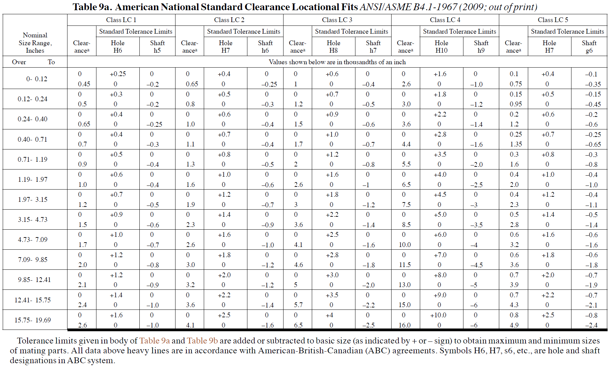
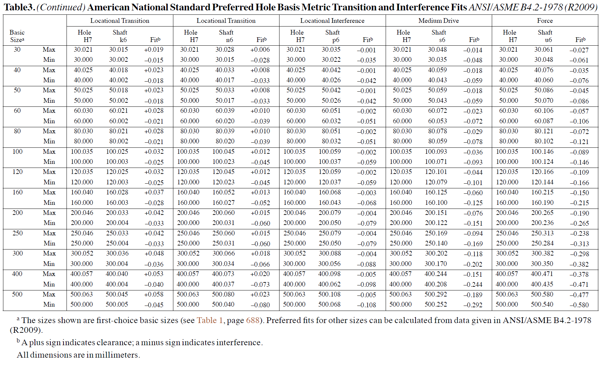
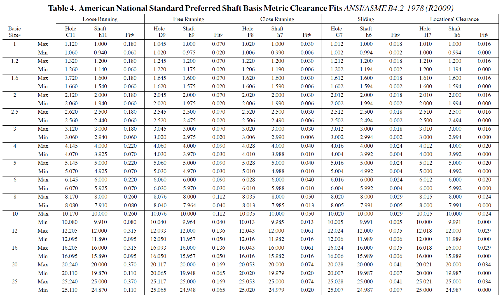
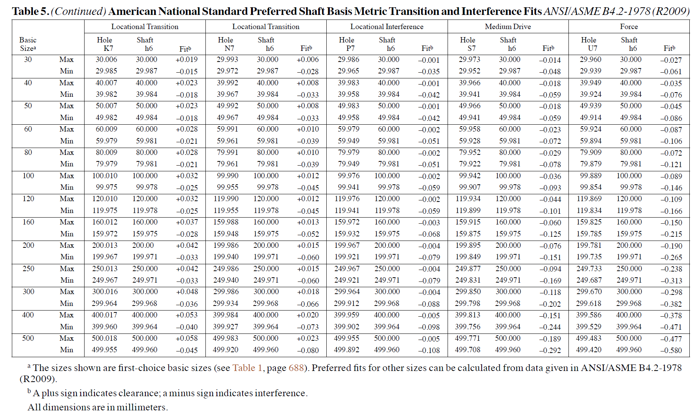

# Engineering Fits and Tolerances {#fits}

In precision manufacturing, the relationship between two mating parts—typically a hole and a shaft—is defined by the "fit." Understanding imperial fits is crucial for ensuring that mechanical assemblies function correctly, whether they need to slide freely or be permanently locked together.

## The Concept of Basis Systems

Before diving into the types of fits, we must establish the reference point for the tolerance. In the imperial system, we generally use one of two approaches:

* **Hole Basis System**: The hole size is kept constant (usually at the basic size), and the shaft size is varied to achieve the desired fit. This is the most common industry standard because it is easier to drill or ream a hole to a standard size than it is to precision-grind a shaft.
* **Shaft Basis System**: The shaft size is kept constant, and the hole size is varied. This is typically reserved for specific cases, such as when a single shaft must host multiple components with different fit requirements.


---

## Imperial Fits {#imperial-fits}

Imperial fits are categorized by their function and the resulting "allowance" (the minimum clearance or maximum interference) between parts.

### a) Clearance Fits {-}
Clearance fits always provide a positive space between the hole and the shaft. This ensures the parts can move or rotate.

* **Running or Sliding Fits (RC)**: Intended to provide a similar running performance with suitable lubrication allowance.
* **Locational Clearance Fits (LC)**: Designed for parts that are normally stationary but can be freely assembled or disassembled.

### b) Interference Fits {-}
Interference fits (or "press fits") occur when the shaft is intentionally larger than the hole.

* **Force and Shrink Fits (FN)**: These require significant force or thermal expansion/contraction (e.g., heating the hole or freezing the shaft) to assemble. They are used for permanent attachments.

### c) Transition Fits (Locational) {-}
Transition fits (**LT**) are the middle ground. Depending on the actual size of the manufactured parts within their tolerance zones, the result could be either a slight clearance or a slight interference. These are used where accurate location is important, but a small amount of clearance or interference is permissible.

```{r, echo=FALSE, out.width="75%", fig.align="center", fig.cap="Fit Categories [@jensen2015interpreting]"}
knitr::include_graphics("images/C20_F02_pg145.jpg")
```

### Description of Imperial Fits {#description-of-imperial-fits}

The classes of fits are arranged in three general groups: running and sliding fits, locational fits, and force fits. These classifications ensure that mechanical components interact with the intended level of friction, precision, and permanence [@jensen2015interpreting].

#### Running and Sliding Fits (RC) {#running-fits}
Running and sliding fits are intended to provide a similar running performance, with suitable lubrication allowance, throughout the range of sizes. The clearances for the first two classes, used chiefly as slide fits, increase more slowly with the diameter than for the other classes so that accurate location is maintained even at the expense of free relative motion.

* **RC 1 Close sliding fits**: Intended for the accurate location of parts that must assemble without perceptible play.
* **RC 2 Sliding fits**: Intended for accurate location, but with greater maximum clearance than class RC 1. Parts move and turn easily but are not intended to run freely; larger sizes may seize with small temperature changes.
* **RC 3 Precision running fits**: The closest fits expected to run freely. Intended for precision work at slow speeds and light journal pressures. Not suitable where appreciable temperature differences are likely.
* **RC 4 Close running fits**: Intended chiefly for running fits on accurate machinery with moderate surface speeds and journal pressures, where accurate location and minimum play are desired.
* **RC 5 and RC 6 Medium running fits**: Intended for higher running speeds, heavy journal pressures, or both.
* **RC 7 Free running fits**: Intended for use where accuracy is not essential, or where large temperature variations are likely to be encountered.
* **RC 8 and RC 9 Loose running fits**: Intended for use where wide commercial tolerances may be necessary, together with an allowance on the external member.

```{r, echo=FALSE, out.width="75%", fig.align="center", fig.cap="[RC1 to RC4](images/ANSI_ASME_B41_RC1_4.png)"}
knitr::include_graphics("images/ANSI_ASME_B41_RC1_4.png")
```
```{r, echo=FALSE, out.width="75%", fig.align="center", fig.cap="[RC5 to RC9](images/ANSI_ASME_B41_RC5_9.png)"}
knitr::include_graphics("images/ANSI_ASME_B41_RC5_9.png")
```

---

#### Locational Fits (LC, LT, and LN) {#locational-fits}
Locational fits are intended to determine only the location of the mating parts; they may provide rigid or accurate location (as with interference fits) or provide some freedom of location (as with clearance fits).

* **LC Locational clearance fits**: Intended for parts that are normally stationary but can be freely assembled or disassembled. They range from snug fits to looser fastener fits.
* **LT Locational transition fits**: A compromise between clearance and interference for applications where accuracy of location is important but a small amount of either clearance or interference is permissible.
* **LN Locational interference fits**: Used where accuracy of location is of prime importance, providing rigidity and alignment with no special requirements for bore pressure.

```{r, echo=FALSE, out.width="75%", fig.align="center", fig.cap="[LC1 to LC5](images/ANSI_ASME_B41_LC1_5.png)"}

```

```{r, echo=FALSE, out.width="75%", fig.align="center", fig.cap="[LC6 to LC11](images/ANSI_ASME_B41_LC6_11.png)"}
knitr::include_graphics("images/ANSI_ASME_B41_LC6_11.png")
```

```{r, echo=FALSE, out.width="75%", fig.align="center", fig.cap="[LT1 to LT6](images/ANSI_ASME_B41_LT1_6.png)"}
knitr::include_graphics("images/ANSI_ASME_B41_LT1_6.png")
```
---

#### Force Fits (FN) {#force-fits}
Force or shrink fits constitute a special type of interference fit, normally characterized by maintenance of constant bore pressures throughout the range of sizes. As shown in the mathematical section of Chapter \@ref(imperial-fits), the interference varies almost directly with diameter.

* **FN 1 Light drive fits**: Require light assembly pressures and produce more or less permanent assemblies. Suitable for thin sections or long fits.
* **FN 2 Medium drive fits**: Suitable for ordinary steel parts or for shrink fits on light sections. These are the tightest fits typically used with high-grade cast-iron external members.
* **FN 3 Heavy drive fits**: Suitable for heavier steel parts or for shrink fits in medium sections.
* **FN 4 and FN 5 Force fits**: Suitable for parts that can be highly stressed or for shrink fits where the heavy pressing forces required are impractical.

```{r, echo=FALSE, out.width="75%", fig.align="center", fig.cap="[FN1 to FN5 small diameters](images/ANSI_ASME_B41_FN1_5.png)"}
knitr::include_graphics("images/ANSI_ASME_B41_FN1_5.png")
```

```{r, echo=FALSE, out.width="75%", fig.align="center", fig.cap="[FN1 to FN5 big diameters](images/ANSI_ASME_B41_FN1_5_big.png)"}
knitr::include_graphics("images/ANSI_ASME_B41_FN1_5_big.png")
```

> **Note:** For other numerical limits of clearance or interference for these classes, refer to the standard ANSI B4.1 tables.

## Metric Fits and the ISO Letter System {#metric-fits}

In precision engineering, the relationship between two mating parts—typically a hole and a shaft—is defined by a "fit." The ISO system uses a specific alphanumeric code to define the tolerances of these parts, ensuring that components manufactured in different locations will assemble correctly according to [@ansi_b41].

### The Letter System: Holes vs. Shafts

The fundamental rule of the metric tolerance system is the distinction between internal and external features through the use of character casing:

* **Capital Letters (A–ZC):** Used exclusively for **Internal Features** (e.g., Holes).
* **Lower-case Letters (a–zc):** Used exclusively for **External Features** (e.g., Shafts).

### Alphabetical Progression and the "H" Pivot

The "H" (for holes) and "h" (for shafts) designations serve as the central pivot point of the metric system. In a standard hole-basis system, an **H** hole has a lower deviation of zero, meaning the hole is never smaller than the nominal "Basic Size." 

The type of fit is determined by where the mating part's letter falls in the alphabet relative to this pivot:

* **Earlier in the Alphabet (A–G / a–g):** When these letters are combined with an H/h feature, they result in a **Clearance Fit**. For example, an $f7$ shaft is significantly smaller than the nominal size, ensuring space between parts.
* **The Middle (H / h):** These represent the basic sizes where the tolerance zone sits exactly on the zero line.
* **Later in the Alphabet (P–ZC / p–zc):** Letters appearing after H/h (specifically starting around $p$ for shafts) produce an **Interference Fit**. These parts are mathematically larger than the hole, requiring force for assembly. Letters between G and P (like $j, k, m, n$) typically result in **Transition Fits**.

> **Note:** Either the shaft or the hole must have an **H/h**. Both can have it.

---

### Metric Hole Basis Fits

In hole basis fits the hole always has the **H**. Preferred combinations of hole and shaft sizes can be found in this chart below.

```{r, echo=FALSE, out.width="75%", fig.align="center", fig.cap="[Preferred Hole Basis Sizes (metric)](images/PreferredHoleBasis_metric.png)"}
knitr::include_graphics("images/PreferredHoleBasis_metric.png")
```


Depending on the combination of the hole and shaft tolerance zones, fits are categorized into two primary types:

####  **Metric Clearance Fit:** 
The shaft is always smaller than the hole. This allows for rotation or sliding.

```{r, echo=FALSE, out.width="75%", fig.align="center", fig.cap="[Metric Clearance Fits Hole Basis Part 1](images/ANSI_ASME_B41_metric_clearance1.png)"}
knitr::include_graphics("images/ANSI_ASME_B41_metric_clearance1.png")
```

```{r, echo=FALSE, out.width="75%", fig.align="center", fig.cap="[Metric Clearance Fits Hole Basis Part 2](images/ANSI_ASME_B41_metric_clearance2.png)"}
knitr::include_graphics("images/ANSI_ASME_B41_metric_clearance2.png")
```

####  **Metric Interference Fit:** 
The shaft is always larger than the hole. Assembly usually requires force, heat expansion, or cryo-shrinking.

```{r, echo=FALSE, out.width="75%", fig.align="center", fig.cap="[Metric Interference Fits Hole Basis Part 1](images/ANSI_ASME_B41_metric_transition1.png)"}
knitr::include_graphics("images/ANSI_ASME_B41_metric_transition1.png")
```

```{r, echo=FALSE, out.width="75%", fig.align="center", fig.cap="[Metric Interference Fits Hole Basis Part 2](images/ANSI_ASME_B41_metric_transition2.png)"}

```

### Metric Shaft Basis Fits

In shaft basis fits the shaft always has the **h**. Preferred combinations of hole and shaft sizes can be found in this chart below.

```{r, echo=FALSE, out.width="75%", fig.align="center", fig.cap="[Preferred Shaft Basis Sizes (metric)](images/PreferredShaftBasis_metric.png)"}
knitr::include_graphics("images/PreferredShaftBasis_metric.png")
```


Depending on the combination of the hole and shaft tolerance zones, fits are categorized into two primary types:

####  **Metric Clearance Fit:** 
The shaft is always smaller than the hole. This allows for rotation or sliding.

```{r, echo=FALSE, out.width="75%", fig.align="center", fig.cap="[Metric Clearance Fits Shaft Basis Part 1](images/ANSI_ASME_B41_metric_clearance1S.png)"}

```

```{r, echo=FALSE, out.width="75%", fig.align="center", fig.cap="[Metric Clearance Fits Shaft Basis Part 2](images/ANSI_ASME_B41_metric_clearance2S.png)"}

```

####  **Metric Interference Fit:** 
The shaft is always larger than the hole. Assembly usually requires force, heat expansion, or cryo-shrinking.

```{r, echo=FALSE, out.width="75%", fig.align="center", fig.cap="[Metric Interference Fits Shaft Basis Part 1](images/ANSI_ASME_B41_metric_transition1S.png)"}
knitr::include_graphics("images/ANSI_ASME_B41_metric_transition1S.png")
```

```{r, echo=FALSE, out.width="75%", fig.align="center", fig.cap="[Metric Interference Fits Shaft Basis Part 2](images/ANSI_ASME_B41_metric_transition2S.png)"}

```


The mathematical relationship for the maximum clearance ($C_{max}$) and maximum interference ($I_{max}$) can be expressed as:

$$C_{max} = Hole_{max} - Shaft_{min}$$
$$I_{max} = Shaft_{max} - Hole_{min}$$

---

### Visualizing Tolerance Zones 

To better understand how different shaft letters (e.g., g, k, p) interact with a standard $H7$ hole, we can visualize the deviation ranges using `ggplot2`. 

```{r fit-visualization, echo=FALSE, message=FALSE, fig.cap="Comparison of Shaft Tolerance Zones relative to an H7 Hole (10-18mm range)"}
library(ggplot2)

# Data representing deviations in micrometers (um) for a 10-18mm nominal size
# Values based on standard ISO 286 tables
fit_data <- data.frame(
  feature = factor(c("H7 (Hole)", "g6 (Clearance)", "k6 (Transition)", "p6 (Interference)"),
                   levels = c("H7 (Hole)", "g6 (Clearance)", "k6 (Transition)", "p6 (Interference)")),
  min_dev = c(0, -17, 1, 18),
  max_dev = c(18, -6, 12, 29),
  type = c("Hole", "Shaft", "Shaft", "Shaft")
)

ggplot(fit_data, aes(x = feature, ymin = min_dev, ymax = max_dev, color = type)) +
  geom_linerange(linewidth = 8) +
  geom_hline(yintercept = 0, linetype = "dashed", color = "black") +
  labs(title = "ISO Fit Tolerance Zones",
       subtitle = "Deviations for Nominal Size 10-18mm",
       y = "Deviation from Nominal (μm)",
       x = "Fit Designation") +
  theme_minimal() +
  scale_color_manual(values = c("Hole" = "#2c3e50", "Shaft" = "#e74c3c"))
```

### Identifying Fit Types

As shown in Figure \@ref(fig:fit-visualization), the position of the shaft zone relative to the zero line (the nominal size) and the hole zone determines the fit category. To identify these in practice, observe the relationship between the two tolerance bands:

* **Clearance Fit:** Identified when the shaft tolerance range is entirely below the hole range. For example, a $g6$ shaft paired with an $H7$ hole ensures there is always space for lubricant or movement.
* **Interference Fit:** Identified when the shaft tolerance range is entirely above the hole range. A $p6$ shaft is physically larger than the $H7$ hole, requiring press-fitting or thermal expansion for assembly.
* **Transition Fit:** Identified when the two ranges overlap. Using a $k6$ shaft means that, depending on the manufacturing deviation within the allowed limits, you may end up with either a slight clearance or a slight interference.


> **Technical Note:** The number following the letter (e.g., the '7' in $H7$) represents the **International Tolerance Grade (IT)**. This represents the magnitude of the tolerance zone. Mathematically, as the IT grade increases, the manufacturing window widens, meaning a looser requirement for precision.
